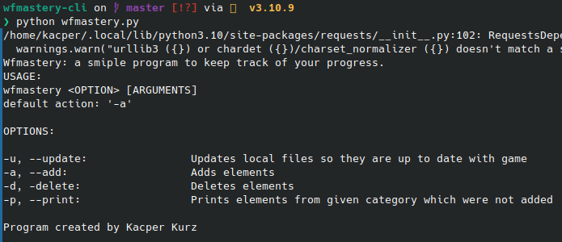
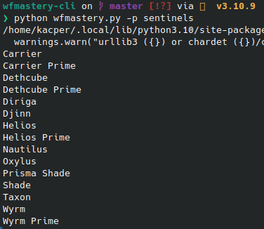

[![Contributors][contributors-shield]][contributors-url]
[![Forks][forks-shield]][forks-url]
[![Stargazers][stars-shield]][stars-url]
[![Issues][issues-shield]][issues-url]
[![MIT License][license-shield]][license-url]
[![LinkedIn][linkedin-shield]][linkedin-url]


<!-- PROJECT LOGO -->
<br />
<p align="center">
  <a href="https://github.com/KacperKurz/wfmastery-cli">
  </a>

  <h3 align="center">WFMastery CLI</h3>

  <p align="center">
    A simple cli application made for my programming intro course that allows user to track their progress in the game Warframe.
    <br />
    <a href="https://github.com/KacperKurz/wfmastery-cli"><strong>Explore the docs »</strong></a>
    <br />
    <br />
    <a href="https://github.com/KacperKurz/wfmastery-cli/issues">Report Bug</a>
    ·
    <a href="https://github.com/KacperKurz/wfmastery-cli/issues">Request Feature</a>
  </p>


<!-- TABLE OF CONTENTS -->
<details open="open">
  <summary><h2 style="display: inline-block">Table of Contents</h2></summary>
  <ol>
    <li>
      <a href="#about-the-project">About The Project</a>
      <ul>
        <li><a href="#built-with">Built With</a></li>
      </ul>
    </li>
    <li>
      <a href="#getting-started">Getting Started</a>
      <ul>
        <li><a href="#prerequisites">Prerequisites</a></li>
        <li><a href="#installation">Installation</a></li>
      </ul>
    </li>
    <li><a href="#usage">Usage</a></li>
    <li><a href="#contact">Contact</a></li>
    <li><a href="#acknowledgements">Acknowledgements</a></li>
  </ol>
</details>


<!-- ABOUT THE PROJECT -->
## About The Project




### Built With

* [Python](https://www.python.org/)


<!-- GETTING STARTED -->
## Getting Started

To get a local copy up and running follow these simple steps.

### Prerequisites

* python

### Installation

1. Clone the repo
   ```sh
   git clone https://github.com/KacperKurz/wfmastery-cli.git
   ```
2. Run the application
   ```sh
   python wfmastery.py
   ```


<!-- USAGE EXAMPLES -->
## Usage

To check basic usage you can run the application without any arguments. It will show you all available commands and their usage.

The available options are:
* -a, --add - adds a new mastery entry
* -d, --delete - deletes a mastery entry
* -u, --update - updates csv files with new data
* -p, --print - prints all mastery entries from given category


<!-- CONTACT -->
## Contact

Kacper Kurz - kacperkurz@protonmail.com

Project Link: [https://github.com/KacperKurz/wfmastery-cli](https://github.com/KacperKurz/wfmastery-cli)


<!-- ACKNOWLEDGEMENTS -->
## Acknowledgements

* [Warframe Community Developers](https://github.com/WFCD)


<!-- MARKDOWN LINKS & IMAGES -->
<!-- https://www.markdownguide.org/basic-syntax/#reference-style-links -->
[contributors-shield]: https://img.shields.io/github/contributors/KacperKurz/wfmastery-cli.svg?style=for-the-badge
[contributors-url]: https://github.com/KacperKurz/wfmastery-cli/graphs/contributors
[forks-shield]: https://img.shields.io/github/forks/KacperKurz/wfmastery-cli.svg?style=for-the-badge
[forks-url]: https://github.com/KacperKurz/wfmastery-cli/network/members
[stars-shield]: https://img.shields.io/github/stars/KacperKurz/wfmastery-cli.svg?style=for-the-badge
[stars-url]: https://github.com/KacperKurz/wfmastery-cli/stargazers
[issues-shield]: https://img.shields.io/github/issues/KacperKurz/wfmastery-cli.svg?style=for-the-badge
[issues-url]: https://github.com/KacperKurz/wfmastery-cli/issues
[license-shield]: https://img.shields.io/github/license/KacperKurz/wfmastery-cli.svg?style=for-the-badge
[license-url]: https://github.com/KacperKurz/wfmastery-cli/blob/master/LICENSE.txt
[linkedin-shield]: https://img.shields.io/badge/-LinkedIn-black.svg?style=for-the-badge&logo=linkedin&colorB=555
[linkedin-url]: https://linkedin.com/in/kacper-kurz-175707199/
